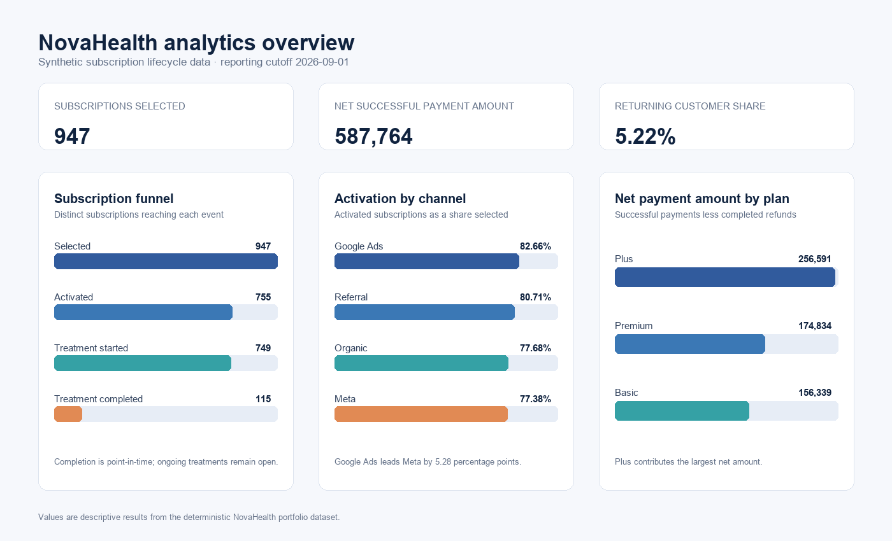
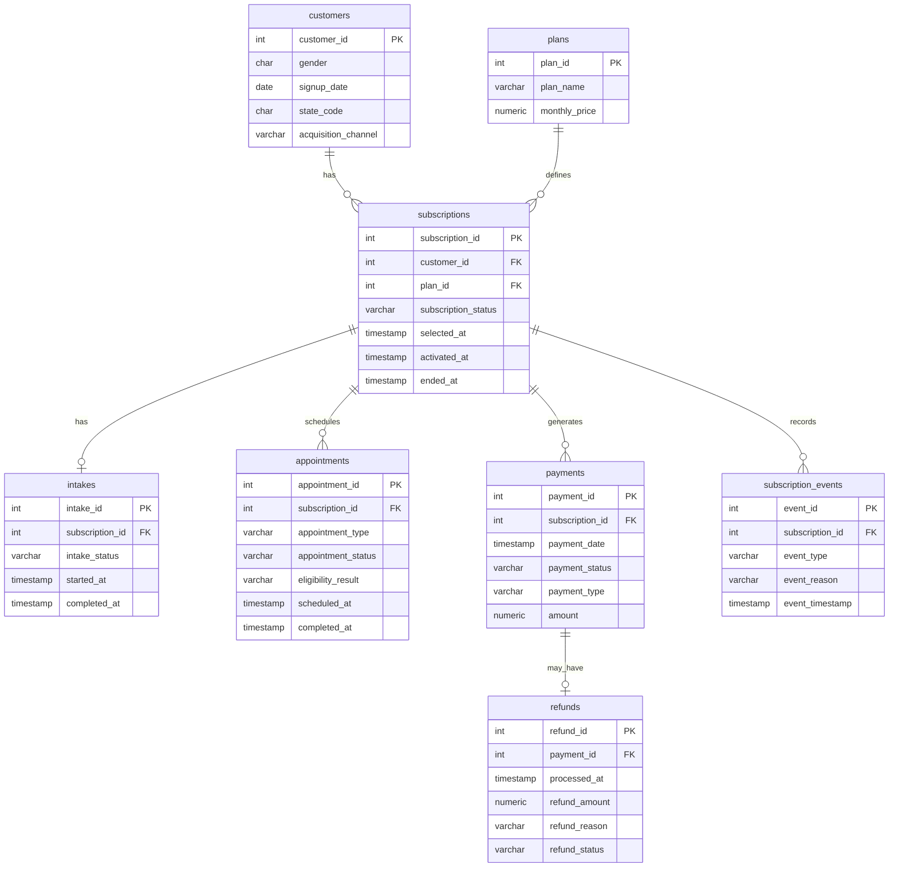

# NovaHealth PostgreSQL Analytics Project

NovaHealth is a fictional digital healthcare subscription business.
This project models the customer journey from signup and plan selection through intakes, appointments, payments, treatment, cancellation and refunds.

The dataset is entirely synthetic and was created for portfolio and educational purposes.

## Project objectives

1. Designing a normalized PostgreSQL database.
2. Generating realistic, deterministic subscription lifecycle data.
3. Applying primary keys, foreign keys and data-quality constraints.
4. Validating relationships and chronological consistency.
5. Analyzing conversion, retention, payments, refunds and customer behavior.

## Database structure

The project contains eight related tables:

- `customers`
- `plans`
- `subscriptions`
- `intakes`
- `appointments`
- `payments`
- `refunds`
- `subscription_events`

## Dataset overview

- 1,000 synthetic customers
- 947 subscriptions
- 947 intake records
- 1,318 appointments
- 12,654 payments
- 89 refund requests
- 2,826 subscription events

The dataset uses a reporting cutoff of `2026-09-01 23:59:59`.

## Portfolio dashboard



## Data model



## Analysis coverage

- Subscription funnel and conversion
- Acquisition-channel activation
- Intake and appointment outcomes
- Treatment and cancellation behavior
- Payments, refunds, and monthly trends
- Returning-customer behavior

## Key findings

- Google Ads has the highest activation rate at 82.66%.
- 90.95% of renewal payments were successful.
- 92.19% of intakes were completed.
- Plan cancellation percentages are close, ranging from 21.37% to 22.85%.
- Successful payment amounts total 592,032.00 before refunds and 587,764.00 after completed refunds.

## Interpretation notes

- The data is synthetic and deterministic.
- Results are point-in-time as of the reporting cutoff.
- Pending and scheduled records are unresolved.
- Treatment completion percentages may rise after the cutoff.
- The analysis is descriptive and doesn’t establish causation.

## Repository structure

```
assets/
    novahealth-dashboard.png

data/
    customers.csv

sql/
    01_schema.sql
    02_seed.sql
    03_validation.sql
    04_analysis.sql
```

- `novahealth-dashboard.png` summarizes selected portfolio findings.
- `01_schema.sql` creates the database tables and constraints.
- `02_seed.sql` generates deterministic synthetic operational data.
- `03_validation.sql` contains summary and integrity checks.
- `04_analysis.sql` contains portfolio analysis queries.
- `customers.csv` contains synthetic customer attributes generated with Mockaroo.

## Running the project

1. Create an empty PostgreSQL database.
2. Run `sql/01_schema.sql`.
3. Import `data/customers.csv` into the `customers` table.
4. Run `sql/02_seed.sql` once.
5. Run `sql/03_validation.sql` and review the validation results.
6. Run the queries in `sql/04_analysis.sql`.

When importing `customers.csv`, map these four columns:

- `gender`
- `signup_date`
- `state_code`
- `acquisition_channel`

The `customer_id` column is generated automatically by PostgreSQL.

## Tools

- PostgreSQL
- pgAdmin
- SQL
- Visual Studio Code
- Git and GitHub

## Status

Database design, synthetic data generation, validation, and portfolio analysis are complete.
